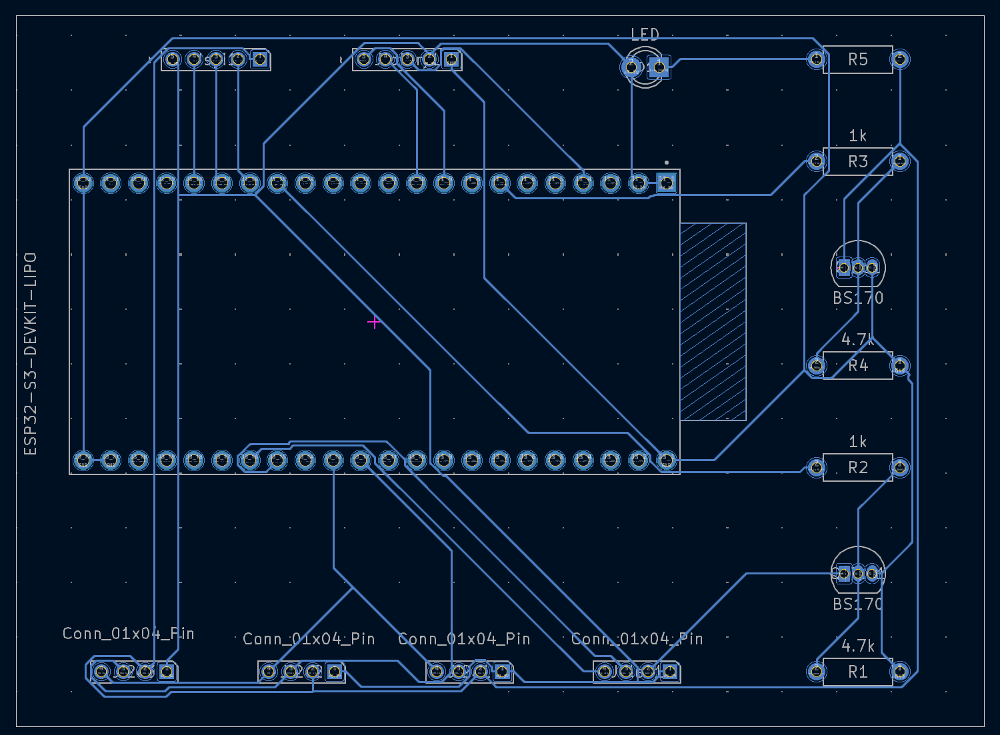

# Differential Pressure Datalogger - PCB Design

This directory contains the KiCad project files for the custom PCB designed for the ESP32-S3 Differential Pressure Datalogger.

## Board Overview

The board is designed to be a compact, battery-powered datalogging platform. It integrates all the necessary components for sensing, data storage, user interaction, and power management.

The following diagram shows how the main peripherals are connected to the ESP32 microcontroller:

The following image shows a render of the custom PCB layout:

## Hardware & Compatibility

This project was developed and tested on the following hardware:

*   **[OLIMEX ESP32-S3-DevKit-LiPo](https://github.com/OLIMEX/ESP32-S3-DevKit-LiPo)**: This board was used for much of the development. It features a built-in LiPo battery charger and management circuit, which works seamlessly with the software's battery monitoring capabilities.
*   **Generic ESP32-S3 Dev-board**: Testing was also performed on a no-brand ESP32-S3 development board.

The software is designed to be portable and is expected to work on any ESP32-S3 based board with the correct peripheral connections. The only feature that is highly dependent on the specific board's hardware implementation is the **battery gauging**, which requires a specific voltage divider circuit on the ADC pin as detailed in the pinout table.

### Key Components

*   **Microcontroller**: ESP32-S3-WROOM-1 module.
*   **Sensors**:
    *   I2C BMP280 for atmospheric pressure and temperature.
    *   I2C [Omron D6F-PH](https://omronfs.omron.com/en_US/ecb/products/pdf/en-d6f_ph.pdf) for differential pressure. The software is written to support the `D6F-PH-0505AD3` (+/- 50 Pa), `D6F-PH-0025AD1` (+/- 250 Pa), and `D6F-PH-5050AD4` (+/- 500 Pa) models, selectable via the `config.ini` file.
*   **Timekeeping**: A generic **DS3231** I2C Real-Time Clock (RTC) module with a backup battery.
*   **Storage**: A **SPI bus** microSD card reader for data logging.
*   **User Interface**:
    *   2.42 Inch 128x64 I2C OLED display. (these often come configured for SPI and require some jumper soldering to be repurposed for I2C). 
    *   A standard 5-pin rotary encoder with a push-button.
*   **Connectivity**: USB-C for programming, power, and accessing the SD card as a Mass Storage Device.
*   **Power**: 3.7V LiPo battery with integrated protection circuitry. 

Apart form the Omron differential pressure sensor, all other devices are run of the mill stuff, easy to source from Aliexpress/Amazon and often icluded in esp32/Arudino starter kits. 

### Power System

All components used in this project are **3.3V devices**. It is critical **not to mix 5V and 3.3V logic levels** in the same circuit, as this would damage the components, especially the Omron D6F-PH sensor which is not 5V tolerant.

The custom PCB design primarily consists of pin headers (I2C, SPI, etc.) to connect these components in their breakout board form. The other components on the board are standard passives like resistors, along with BS170 MOSFETs for power control and JST connectors for external hardware.

The BS170 mosfets can be replaced with pretty much any N channel mosfet that can be turned on with 3.3V gate voltage, **IRLZ34N** have been tested and work just fine.

## Hardware Deep Sleep Implementation

To achieve ultra-low power consumption (under 1mA) during deep sleep, the board implements a hardware power-gating strategy. Two separate GPIO pins are used to control the power supply to different sets of peripherals:

*   **`DEVICES_POWER` (GPIO 15)**: This pin controls a MOSFET that supplies power to the main I2C bus peripherals (BMP280, D6F-PH) and the SD card. Before entering deep sleep, the ESP32 sets this pin low, completely cutting power to these components. This is the primary mechanism for power saving, reducing consumption by over 85%. The DS3231 RTC is on a separate, always-on power rail to maintain timekeeping.
*   **`OLED_POWER` (GPIO 16)**: This pin independently controls the power to the OLED display. This allows the screen to be turned off after a period of inactivity, even while the rest of the device is still running and logging data.

This hardware design allows the software to aggressively manage power, ensuring long battery life for a portable datalogger.

## Pinout

The following table details the GPIO connections for the main peripherals.

| Peripheral          | Pin Name        | ESP32-S3 GPIO | Notes                                 |
| ------------------- | --------------- | ------------- | ------------------------------------- |
| **Power Control**   | `DEVICES_POWER` | 7             | Controls power to sensors/peripherals |
|                     | `OLED_POWER`    | 15            | Controls power to the OLED display    |
|                     | `I2C0_SCL`      | 36            |                                       |
|                     | `I2C0_SDA`      | 35            |
| **OLED I2C Bus**    | `I2C1_SCL`      | 45            | Dedicated bus for the display         |
|                     | `I2C1_SDA`      | 48            |                                       |
| **SD Card (SPI)**   | `SPI_MOSI`      | 11            | Standard SPI pins for SD card         |
|                     | `SPI_MISO`      | 12            |                                       |
|                     | `SPI_CLK`       | 10            |                                       |
|                     | `SPI_CS`        | 13            |                                       |
| **Rotary Encoder**  | `ENC_A`         | 4             |                                       |
|                     | `ENC_B`         | 16            |                                       |
|                     | `ENC_BTN`       | 17            | Also used as a deep sleep wakeup pin  |
| **Battery Monitor** | `BATT_PWR`      | 5             | Detects external power                |
|                     | `BATT_ADC`      | 6             | ADC input for voltage measurement     |

// --- RTC Memory for State Persistence ---
// These variables retain their values across deep sleep cycles.
static RTC_DATA_ATTR write_status_t rtc_last_write_status = WRITE_STATUS_UNKNOWN;
static RTC_DATA_ATTR time_t rtc_last_successful_write_ts = 0;
static RTC_DATA_ATTR datalogger_mode_t rtc_datalogger_mode = DATALOGGER_MODE_NORMAL;
static RTC_DATA_ATTR uint64_t rtc_total_awake_time_s = 0;
static RTC_DATA_ATTR uint64_t rtc_last_boot_time_ms = 0;

static const char *TAG = "main";

typedef enum
{
    I2C_BUS_SENSORS, // I2C_NUM_0 for main peripherals
    I2C_BUS_OLED,    // I2C_NUM_1 for the display
    I2C_BUS_ALL      // Both buses
} i2c_bus_target_t;

ds3231_t g_rtc;    // Global RTC device handle
bmp280_t g_bmp280; // Global BMP280 device handle
d6fph_t g_d6fph;   // Global D6F-PH device handle

TaskHandle_t g_datalogger_task_handle = NULL;
TaskHandle_t g_uiRender_task_handle = NULL;
i2c_master_bus_handle_t g_i2c_bus0_handle = NULL;
i2c_master_bus_handle_t g_i2c_bus1_handle = NULL;

## I2C Bus Considerations

When extending the I2C bus, especially with longer cables, it's crucial to consider the impact of cable capacitance. Excessive capacitance can degrade signal integrity, leading to communication errors or complete bus failure. It is  recommended to keep total I2C bus length below 2-3 meters (total of all paralleled cables) to stay within acceptable capacitance limits.

To improve reliability over longer distances, several strategies can be employed:

*   **Pull-up Resistor Values**: The I2C bus requires pull-up resistors on both SDA and SCL lines. Keeping these values relatively low can help overcome capacitance effects. This board has been successfully tested with a total pull-up resistance of 3 kOhm (measured between Vcc and SDA/SCL pins) on a 4-meter cable length, operating at 100 kHz.
*   **Avoid Too Low Pull-ups**: While lower pull-up values are generally better for longer cables, care must be taken not to go too low. If I2C devices on the bus happen to have small internal pull-up resistors, they can effectively parallel with external resistors. The combined equivalent resistance should not cause overcurrents on i2c pins as going too low can lead to excessive current draw and signal distortion, 6mA capable pins should never be paired with less than 1kohm total pull up resistance.
*   **Cable Type**: Using twisted pair cables for SDA/SCL lines can significantly reduce noise and maintain signal integrity over distance. This practice helps in keeping the total bus capacitance below the recommended 400 picofarad limit for standard I2C operation.

For applications requiring longer I2C bus lengths or higher speeds, dedicated I2C bus extenders or buffers might be necessary.

## Design Files

This project was designed using **KiCad**. The main files are:

*   `DifferentialPressureSensor.kicad_pro`: The main KiCad project file.
*   `DifferentialPressureSensor.kicad_sch`: The schematic file.
*   `DifferentialPressureSensor.kicad_pcb`: The PCB layout file.
