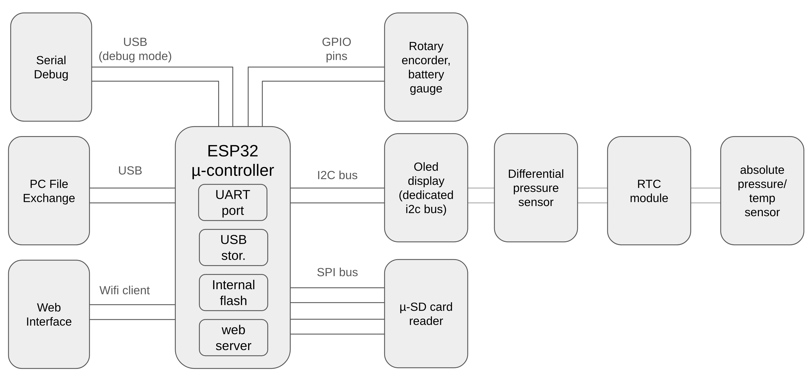

# Differential Pressure Datalogger - PCB Design

This directory contains the KiCad project files for the custom PCB designed for the ESP32-S3 Differential Pressure Datalogger.

## Board Overview

The board is designed to be a compact, battery-powered datalogging platform. It integrates all the necessary components for sensing, data storage, user interaction, and power management.

The following diagram shows how the main peripherals are connected to the ESP32 microcontroller:

### Key Components

*   **Microcontroller**: ESP32-S3-WROOM-1 module.
*   **Sensors**:
    *   BMP280 for atmospheric pressure and temperature.
    *   Omron D6F-PH for differential pressure.
*   **Timekeeping**: DS3231 Real-Time Clock (RTC) with a backup battery.
*   **Storage**: MicroSD card slot for data logging.
*   **User Interface**:
    *   Connector for an I2C OLED display.
    *   Connector for a rotary encoder with a push-button.
*   **Connectivity**: USB-C for programming, power, and accessing the SD card as a Mass Storage Device.

### Power System

*   **Dual Power Source**: The board can be powered via USB-C or a single-cell (1S) LiPo battery.
*   **Battery Monitoring**: An onboard voltage divider allows the ESP32-S3's ADC to measure the battery voltage. The divider is connected via a MOSFET to prevent battery drain when not measuring.
*   **Peripheral Power Control**: A dedicated GPIO pin controls the main power rail for the sensors and peripherals, allowing them to be completely powered down during deep sleep.

## Hardware Deep Sleep Implementation

To achieve ultra-low power consumption (under 1mA) during deep sleep, the board implements a hardware power-gating strategy. Two separate GPIO pins are used to control the power supply to different sets of peripherals:

*   **`DEVICES_POWER` (GPIO 15)**: This pin controls a MOSFET that supplies power to the main I2C bus peripherals (BMP280, D6F-PH) and the SD card. Before entering deep sleep, the ESP32 sets this pin low, completely cutting power to these components. This is the primary mechanism for power saving, reducing consumption by over 85%. The DS3231 RTC is on a separate, always-on power rail to maintain timekeeping.
*   **`OLED_POWER` (GPIO 16)**: This pin independently controls the power to the OLED display. This allows the screen to be turned off after a period of inactivity, even while the rest of the device is still running and logging data.

This hardware design allows the software to aggressively manage power, ensuring long battery life for a portable datalogger.

## Pinout

The following table details the GPIO connections for the main peripherals.

| Peripheral              | Pin Name        | ESP32-S3 GPIO | Notes                               |
| ----------------------- | --------------- | ------------- | ----------------------------------- |
| **Power Control**       | `DEVICES_POWER` | 15            | Controls power to sensors/peripherals |
|                         | `OLED_POWER`    | 16            | Controls power to the OLED display    |
| **Main I2C Bus**        | `I2C0_SDA`      | 38            | For BMP280, DS3231, D6F-PH          |
|                         | `I2C0_SCL`      | 37            |                                     |
| **OLED I2C Bus**        | `I2C1_SDA`      | 40            | Dedicated bus for the display       |
|                         | `I2C1_SCL`      | 39            |                                     |
| **SD Card (SPI)**       | `SPI_MOSI`      | 11            | Standard SPI pins for SD card       |
|                         | `SPI_MISO`      | 13            |                                     |
|                         | `SPI_CLK`       | 12            |                                     |
|                         | `SPI_CS`        | 10            |                                     |
| **Rotary Encoder**      | `ENC_A`         | 41            |                                     |
|                         | `ENC_B`         | 42            |                                     |
|                         | `ENC_BTN`       | 2             | Also used as a deep sleep wakeup pin|
| **Battery Monitor**     | `BATT_ADC_EN`   | 5             | Enables the voltage divider         |
|                         | `BATT_ADC`      | 6             | ADC input for voltage measurement   |

## Design Files

This project was designed using **KiCad**. The main files are:

*   `DifferentialPressureSensor.kicad_pro`: The main KiCad project file.
*   `DifferentialPressureSensor.kicad_sch`: The schematic file.
*   `DifferentialPressureSensor.kicad_pcb`: The PCB layout file.
