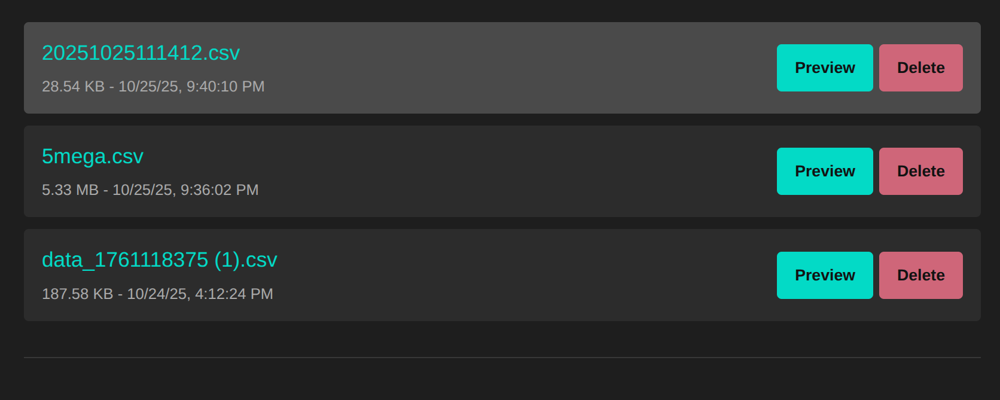

# Web User Interface Guide

This document explains the features and functionality of the web-based user interface, which can be accessed when the device's web server is active.

## Overview

The web UI provides a convenient way to monitor the device, view live data, and manage log files directly from a web browser on a computer or smartphone connected to the same Wi-Fi network.

The interface is divided into three main sections:
1.  **Live Sensor Data**: A real-time dashboard of sensor readings.
2.  **File Browser**: A list of all data log files stored on the SD card.
3.  **File Previewer**: An interactive tool for viewing the contents of log files without downloading them.
## Live Sensor Data

The panel at the top of the page displays the most recent data read from the device's sensors. This data is automatically refreshed every 5 seconds and includes:

*   **Timestamp**: The current date and time from the device's RTC.
*   **Temperature**: Ambient temperature in Celsius.
*   **Pressure**: Atmospheric pressure in kilopascals (kPa).
*   **Diff. Pressure**: Differential pressure in Pascals (Pa).
*   **Battery**: Voltage, percentage, and charging status.

If the web page fails to fetch data, a banner will appear with a "Retry" button to re-establish the connection.

## File Browser

This section lists all files found on the SD card, sorted by the most recently modified. Each entry provides the following information and actions:

*   **Filename**: The name of the log file. Clicking this link will download the file directly to your computer.
*   **File Metadata**: The file size and the date it was last modified.
*   **Preview Button**: Opens the interactive File Previewer for that file.
*   **Delete Button**: Permanently deletes the file from the SD card after a confirmation prompt.

## File Previewer

The File Previewer is a powerful tool for inspecting log data directly on the device.

### CSV vs. Raw Text Files

The previewer automatically detects the file type:
*   **CSV Files**: If the file is recognized as a CSV log, it will be displayed in a scrollable table with a header. At the top, sparkline graphs provide a quick visual summary of the data currently loaded in the table.
*   **Non-CSV Files**: If the file is not a standard log file (e.g., `config.ini`), its contents will be displayed as plain, raw text.

### Navigating CSV Data

The sparkline graphs are designed to provide a quick, at-a-glance overview of the data trends within the currently loaded time window. This is especially useful for getting a quick sense of the data in the field with minimal effort, even without an internet connection.

For a more thorough analysis, especially with very large files, it is recommended to download the CSV file and use a dedicated tool. You can open the file in any spreadsheet program (like Microsoft Excel, Google Sheets, or LibreOffice Calc) or use online data visualization tools that allow you to upload CSV files, such as:
*   CSV Plot
*   Draxlr

Additionally, mobile apps like Smart CSV are excellent for processing and visualizing entire data files on the go.

The previewer is designed to handle very large files efficiently by only loading small chunks of data at a time.

#### Time Window and Navigation

The previewer has two sets of controls for navigation:

1.  **Scale Buttons (`1 hour`, `4 hours`, etc.)**: These buttons set the **size of the time window** to load. When you select a scale, the previewer fetches a chunk of data that covers that duration.
    *   **Performance Note**: For very large files, using a wide time window (like "24 hours" or "Max") can be sluggish, as the device needs to process more data to find the correct starting point. For quicker navigation, it's often better to use a smaller window and jump through the file.

2.  **Jump Buttons (`<<< head`, `< Hour`, `Day >>`, etc.)**: These buttons perform **windowed navigation**, allowing you to "jump" through the file. When you click one of these buttons:
    *   The currently displayed data is **replaced** with a new chunk of data from a different part of the file, based on the button you clicked (e.g., `Day >>` jumps forward 24 hours).
    *   This is the fastest way to move through large files, as it avoids loading all the data in between.

For extremely large or dense files, the most efficient way to perform a full analysis is to download the file and open it on your computer.

#### Data View Toggle

When previewing a CSV file, the sparkline graphs can display either the raw sensor data or the smoothed (Kalman-filtered) data. The filter parameters are configured in `config.ini`.

*   **Smoothed View (Default)**: This view shows the data after it has been processed by the Kalman filter. It is generally cleaner and easier to interpret, as it removes sensor noise.
*   **Raw View**: This view shows the unprocessed data directly from the sensors. It is useful for diagnostics and for observing the unfiltered sensor behavior.

You can switch between these views using the **"Smoothed"** and **"Raw"** toggle buttons located in the "Controls" panel above the data table.

The system uses two distinct sets of Kalman filter parameters: one for normal logging (`kf_*_q`, `kf_*_r`) and one for high-frequency logging (`kf_*_q_hf`, `kf_*_r_hf`). All of these can be configured in `config.ini`. If the high-frequency parameters are not specified, the device will automatically calculate appropriate defaults based on the normal-frequency settings, providing a good baseline for both logging speeds out-of-the-box.

#### Scrolling

You can use your mouse or trackpad to scroll through the data that is currently loaded in the preview table. Scrolling does **not** load new data from the file. To navigate to a different part of the file, you must use the **Scale** and **Jump** buttons.

When you click a navigation button (e.g., `Day >>`), the currently displayed data is replaced with a new chunk from the file, and the scroll position is reset to the top of the new chunk.